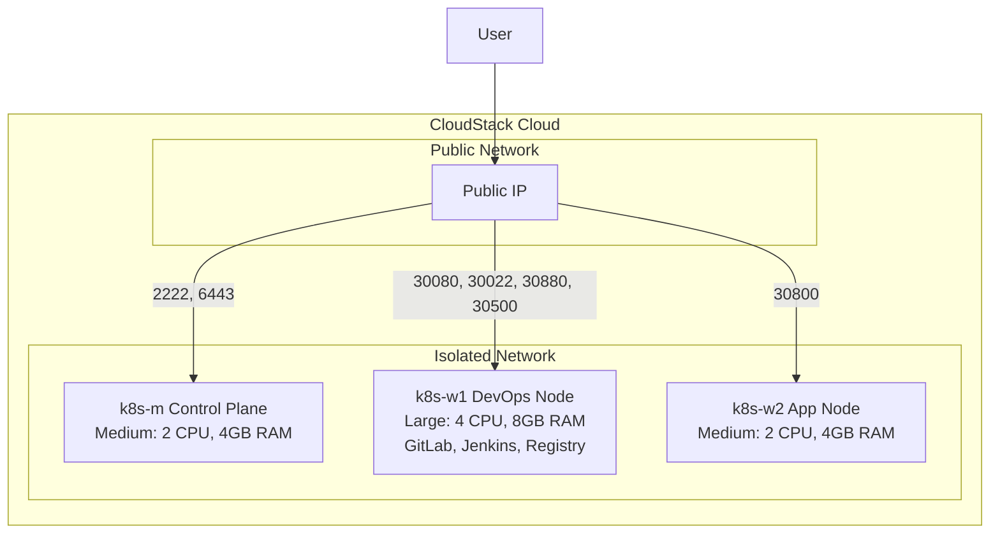
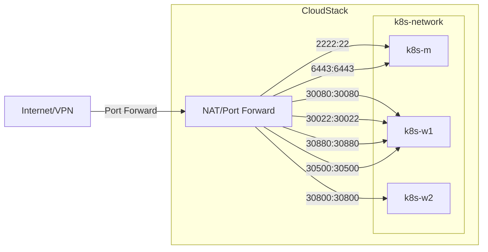

# DKU CI/CD Infrastructure


CloudStack 환경에서 Kubernetes 클러스터를 구축하고, Jenkins, GitLab, Docker Registry를 배포하여 완전한 CI/CD 파이프라인을 구현한 Infrastructure as Code 프로젝트입니다.

**Cloud & Virtualization**


**Infrastructure as Code**


**Containerization & Orchestration**


**Networking**


**CI/CD & Registry**


---

## 목차

- [프로젝트 개요](#프로젝트-개요)
- [인프라 아키텍처](#인프라-아키텍처)
- [사전 요구사항](#사전-요구사항)
- [빠른 시작](#빠른-시작)
- [디렉토리 구조](#디렉토리-구조)
- [서비스 접근 정보](#서비스-접근-정보)
- [주요 설정 참조](#주요-설정-참조)
- [참고 문서](#참고-문서)

---

## 프로젝트 개요

### 수행 목표

CloudStack 환경에서 Kubernetes 클러스터를 구축하고, Jenkins, GitLab, Docker Registry를 배포하여 완전한 CI/CD 파이프라인을 구현합니다.

### 항목별 성공 여부

<table>
<thead>
<tr>
<th align="center">과제</th>
<th>항목</th>
<th align="center">상태</th>
<th>비고</th>
</tr>
</thead>
<tbody>
<tr>
<td align="center" rowspan="6"><strong>과제 1</strong></td>
<td>CloudStack Provider 설정</td>
<td align="center">완료</td>
<td>API endpoint, API key, secret key 설정</td>
</tr>
<tr>
<td>Isolated Network 생성</td>
<td align="center">완료</td>
<td>k8s-network</td>
</tr>
<tr>
<td>Port Forwarding 규칙 생성</td>
<td align="center">완료</td>
<td>7개 규칙 (SSH, K8s API, Jenkins, GitLab, Registry, TestApp)</td>
</tr>
<tr>
<td>Firewall 규칙 생성</td>
<td align="center">완료</td>
<td>7개 포트 개방 (0.0.0.0/0)</td>
</tr>
<tr>
<td>VM 생성 (Master 1대, Worker 2대)</td>
<td align="center">완료</td>
<td>k8s-m, k8s-w1, k8s-w2</td>
</tr>
<tr>
<td>Terraform Output</td>
<td align="center">완료</td>
<td>ansible_inventory 자동 생성</td>
</tr>
<tr>
<td align="center" rowspan="6"><strong>과제 2</strong></td>
<td>Ansible Inventory 생성</td>
<td align="center">완료</td>
<td>Terraform output 기반 자동 생성</td>
</tr>
<tr>
<td>containerd, kubeadm 설치</td>
<td align="center">완료</td>
<td>v1.28.15</td>
</tr>
<tr>
<td>kubeadm init</td>
<td align="center">완료</td>
<td>Control Plane 초기화</td>
</tr>
<tr>
<td>Worker 노드 조인</td>
<td align="center">완료</td>
<td>2대 조인 완료</td>
</tr>
<tr>
<td>CNI (Cilium) 구성</td>
<td align="center">완료</td>
<td>v1.14.5, kube-proxy 대체 모드</td>
</tr>
<tr>
<td>MetalLB 구성</td>
<td align="center">완료</td>
<td>L2 모드</td>
</tr>
<tr>
<td align="center" rowspan="4"><strong>과제 3</strong></td>
<td>Jenkins 배포</td>
<td align="center">완료</td>
<td>NodePort 30880</td>
</tr>
<tr>
<td>GitLab 배포</td>
<td align="center">완료</td>
<td>NodePort 30080, 30022</td>
</tr>
<tr>
<td>Docker Registry 배포</td>
<td align="center">완료</td>
<td>NodePort 30500</td>
</tr>
<tr>
<td>PVC 구성</td>
<td align="center">완료</td>
<td>hostPath 기반</td>
</tr>
<tr>
<td align="center" rowspan="4"><strong>과제 4</strong></td>
<td>GitLab 테스트 프로젝트</td>
<td align="center">완료</td>
<td>testapp</td>
</tr>
<tr>
<td>Jenkins Pipeline</td>
<td align="center">완료</td>
<td>Build, Push, Deploy</td>
</tr>
<tr>
<td>Registry 이미지 Push</td>
<td align="center">완료</td>
<td>testapp:latest</td>
</tr>
<tr>
<td>Kubernetes 배포</td>
<td align="center">완료</td>
<td>2 replicas</td>
</tr>
</tbody>
</table>

### 기술 스택

- **Cloud Platform:** CloudStack
- **IaC (Infrastructure as Code):** Terraform
- **Configuration Management:** Ansible
- **Container Platform:** Docker
- **Container Runtime:** containerd v1.7.2
- **Container Orchestration:** Kubernetes v1.28.15
- **CNI:** Cilium v1.14.5
- **Load Balancer:** MetalLB v0.13.12
- **CI/CD Tools:** Jenkins, GitLab CE
- **Container Registry:** Docker Registry

---

## 인프라 아키텍처

### 전체 아키텍처



### 네트워크 구성



### Port Forwarding 규칙

<table>
<thead>
<tr>
<th>서비스</th>
<th align="center">외부 포트</th>
<th align="center">NodePort</th>
<th align="center">Container Port</th>
<th align="center">포트 포워딩 대상</th>
<th align="center">Pod 배치</th>
</tr>
</thead>
<tbody>
<tr>
<td>SSH (Jump)</td>
<td align="center">2222</td>
<td align="center">-</td>
<td align="center">22</td>
<td align="center">k8s-m</td>
<td align="center">-</td>
</tr>
<tr>
<td>Kubernetes API</td>
<td align="center">6443</td>
<td align="center">-</td>
<td align="center">6443</td>
<td align="center">k8s-m</td>
<td align="center">-</td>
</tr>
<tr>
<td>GitLab HTTP</td>
<td align="center">30080</td>
<td align="center">30080</td>
<td align="center">80</td>
<td align="center">k8s-w1</td>
<td align="center">k8s-w1</td>
</tr>
<tr>
<td>GitLab SSH</td>
<td align="center">30022</td>
<td align="center">30022</td>
<td align="center">22</td>
<td align="center">k8s-w1</td>
<td align="center">k8s-w1</td>
</tr>
<tr>
<td>Jenkins</td>
<td align="center">30880</td>
<td align="center">30880</td>
<td align="center">8080</td>
<td align="center">k8s-w1</td>
<td align="center">k8s-w1</td>
</tr>
<tr>
<td>Docker Registry</td>
<td align="center">30500</td>
<td align="center">30500</td>
<td align="center">5000</td>
<td align="center">k8s-w1</td>
<td align="center">k8s-w1</td>
</tr>
<tr>
<td>TestApp</td>
<td align="center">30800</td>
<td align="center">30800</td>
<td align="center">80</td>
<td align="center">k8s-w2</td>
<td align="center">-</td>
</tr>
</tbody>
</table>

**노드 역할 분리:**
- **k8s-w1 (DevOps Node):** GitLab, Jenkins, Registry 등 DevOps 도구 배치 (Large: 4 CPU, 8GB RAM)
- **k8s-w2 (App Node):** 애플리케이션 워크로드 배치 (Medium: 2 CPU, 4GB RAM)

---

## 사전 요구사항

### CloudStack 환경

- CloudStack 계정 및 API 액세스
- Zone, Network Offering 정보
- SSH 키페어 생성

### 로컬 환경

- **Terraform:** v1.0 이상
- **Ansible:** v2.9 이상
- **kubectl:** v1.28 이상
- **SSH 클라이언트**

### SSH 키 설정

```bash
# SSH 키 생성 (이미 있다면 생략)
ssh-keygen -t rsa -b 4096 -f ~/.ssh/k8s_key -N ""
```

---

## 빠른 시작

### 1. 인프라 프로비저닝 (Terraform)

#### 1.1 Terraform 변수 설정

`terraform/terraform.tfvars` 파일 생성:

```hcl
# CloudStack API 설정
api_url    = "<CloudStack_API_Endpoint>"
api_key    = "<YOUR_API_KEY>"
secret_key = "<YOUR_SECRET_KEY>"

# 네트워크 설정
zone_name         = "YOUR_ZONE"
network_offering  = "DefaultIsolatedNetworkOfferingWithSourceNatService"

# SSH 키
ssh_public_key = "~/.ssh/k8s_key.pub"
```

#### 1.2 Terraform 실행

```bash
cd terraform

# 초기화
terraform init

# 플랜 확인
terraform plan

# 인프라 생성
terraform apply

# Ansible Inventory 자동 생성
terraform output -raw ansible_inventory > ../ansible/inventory/hosts.ini
```

### 2. Kubernetes 클러스터 구성 (Ansible)

#### 2.1 Ansible 변수 확인

`ansible/group_vars/all.yml`에서 버전 확인:

```yaml
kubernetes_version: "1.28"
kubernetes_apt_version: "1.28.15-1.1"
cilium_version: "1.14.5"
metallb_ip_range: "192.168.0.200-192.168.0.250"
```

#### 2.2 Ansible Playbook 실행

```bash
cd ansible

# 클러스터 구성 (containerd, K8s, Cilium, MetalLB)
ansible-playbook -i inventory/hosts.ini site.yml

# 클러스터 상태 확인 (Master 노드에서)
ssh -i ~/.ssh/k8s_key -p 2222 ubuntu@<YOUR_PUBLIC_IP>
kubectl get nodes
```

예상 결과:

```
NAME     STATUS   ROLES           AGE   VERSION
k8s-m    Ready    control-plane   1h    v1.28.15
k8s-w1   Ready    <none>          1h    v1.28.15
k8s-w2   Ready    <none>          1h    v1.28.15
```

### 3. DevOps 도구 배포

#### 3.1 Jenkins 배포

```bash
kubectl apply -f manifests/jenkins/

# 초기 비밀번호 확인
kubectl logs deployment/jenkins -n devops -c jenkins | grep -A 5 "Jenkins initial setup"
```

#### 3.2 GitLab 배포

```bash
kubectl apply -f manifests/gitlab/

# Root 비밀번호 확인
kubectl get secret gitlab-secret -n devops -o jsonpath="{.data.gitlab-root-password}" | base64 -d
```

#### 3.3 Docker Registry 배포

```bash
kubectl apply -f manifests/registry/
```

### 4. CI/CD 파이프라인 검증

#### 4.1 testapp 프로젝트 생성

1. GitLab에서 `testapp` 프로젝트 생성
2. 로컬에서 testapp 디렉토리를 GitLab에 push:

```bash
cd testapp
git init
git remote add origin <GitLab_Repository_URL>
git add .
git commit -m "Initial commit"
git push -u origin main
```

#### 4.2 Jenkins Pipeline 구성

1. Jenkins에서 New Item → Pipeline 선택
2. Pipeline 섹션에서:
   - Definition: `Pipeline script from SCM`
   - SCM: `Git`
   - Repository URL: `<GitLab_Repository_URL>`
   - Script Path: `Jenkinsfile`

#### 4.3 빌드 실행

Jenkins에서 "Build Now" 클릭 후 결과 확인:

```bash
# Kubernetes 배포 확인
kubectl get pods -n devops -l app=testapp
```

---

## 디렉토리 구조

```
/
├── terraform/                 # Terraform IaC 코드
│   ├── provider.tf            # CloudStack Provider 설정
│   ├── main.tf                # 리소스 정의 (VM, Network, Port Forward)
│   ├── variables.tf           # 변수 정의
│   ├── terraform.tfvars.example  # 변수 값 예시 (복사하여 terraform.tfvars 생성)
│   └── outputs.tf             # 출력 정의
├── ansible/                   # Ansible 구성
│   ├── site.yml               # 메인 플레이북
│   ├── group_vars/
│   │   └── all.yml            # 전역 변수
│   ├── inventory/
│   │   └── hosts.ini          # Terraform에서 생성된 인벤토리
│   └── roles/                 # Ansible Roles
│       ├── common/            # 공통 설정 (swap 비활성화 등)
│       ├── containerd/        # containerd 런타임 설치
│       ├── kubernetes/        # kubeadm, kubelet, kubectl 설치
│       ├── k8s_master/        # Master 노드 초기화
│       ├── k8s_worker/        # Worker 노드 조인
│       ├── cni/               # Cilium CNI 설치
│       └── metallb/           # MetalLB 설치
├── manifests/                 # Kubernetes 매니페스트
│   ├── jenkins/               # Jenkins 배포
│   │   ├── namespace.yaml
│   │   ├── deployment.yaml
│   │   ├── service.yaml
│   │   ├── pvc.yaml
│   │   └── config.yaml
│   ├── gitlab/                # GitLab 배포
│   │   ├── deployment.yaml
│   │   ├── service.yaml
│   │   ├── pvc.yaml
│   │   └── secret.yaml
│   ├── registry/              # Docker Registry 배포
│   │   ├── deployment.yaml
│   │   ├── deployment-tls.yaml  # TLS 활성화 버전
│   │   ├── service.yaml
│   │   ├── pvc.yaml
│   │   └── tls-secret.yaml    # TLS 인증서 시크릿
│   └── metallb/               # MetalLB 설정
│       ├── metallb-native.yaml
│       └── config.yaml.j2
├── testapp/                   # 테스트 애플리케이션 (별도 생성 필요)
│   ├── Dockerfile             # 컨테이너 이미지 빌드 정의
│   ├── Jenkinsfile            # CI/CD 파이프라인 정의
│   ├── html/                  # 정적 HTML 파일
│   └── k8s/                   # Kubernetes 배포 매니페스트
├── docs/                      # 문서
│   └── TROUBLESHOOTING.md     # 트러블슈팅 가이드
└── README.md                  # 본 문서
```

---

## 서비스 접근 정보

### 서비스 포트

<table>
<thead>
<tr>
<th>서비스</th>
<th>포트</th>
<th>비고</th>
</tr>
</thead>
<tbody>
<tr>
<td>GitLab HTTP</td>
<td>30080</td>
<td>root / (Secret에 정의)</td>
</tr>
<tr>
<td>GitLab SSH</td>
<td>30022</td>
<td>Git 작업용</td>
</tr>
<tr>
<td>Jenkins</td>
<td>30880</td>
<td>초기 비밀번호 확인 필요</td>
</tr>
<tr>
<td>Docker Registry</td>
<td>30500</td>
<td>비보안 레지스트리</td>
</tr>
<tr>
<td>Kubernetes API</td>
<td>6443</td>
<td>kubeconfig 필요</td>
</tr>
<tr>
<td>SSH (Master)</td>
<td>2222</td>
<td>Master 노드 접근</td>
</tr>
</tbody>
</table>

---

## 주요 설정 참조

### Terraform 변수

<table>
<thead>
<tr>
<th>변수명</th>
<th>기본값</th>
<th>설명</th>
</tr>
</thead>
<tbody>
<tr>
<td><code>network_name</code></td>
<td><code>k8s-network</code></td>
<td>네트워크 이름</td>
</tr>
<tr>
<td><code>network_cidr</code></td>
<td>-</td>
<td>네트워크 CIDR 대역</td>
</tr>
<tr>
<td><code>network_gateway</code></td>
<td>-</td>
<td>게이트웨이 주소</td>
</tr>
<tr>
<td><code>zone_name</code></td>
<td><code>DKU</code></td>
<td>CloudStack Zone 이름</td>
</tr>
</tbody>
</table>

### Ansible 변수

`ansible/group_vars/all.yml`:

```yaml
kubernetes_version: "1.28.15-1.1"
cilium_version: "1.14.5"
```

### Kubernetes 리소스 요약

<table>
<thead>
<tr>
<th>서비스</th>
<th align="center">Namespace</th>
<th align="center">Replicas</th>
<th align="center">Memory Limit</th>
<th align="center">CPU Limit</th>
<th align="center">배포 노드</th>
</tr>
</thead>
<tbody>
<tr>
<td>Jenkins</td>
<td align="center">devops</td>
<td align="center">1</td>
<td align="center">2Gi</td>
<td align="center">1000m</td>
<td align="center">k8s-w1</td>
</tr>
<tr>
<td>GitLab</td>
<td align="center">devops</td>
<td align="center">1</td>
<td align="center">5Gi</td>
<td align="center">2000m</td>
<td align="center">k8s-w1</td>
</tr>
<tr>
<td>Registry</td>
<td align="center">devops</td>
<td align="center">1</td>
<td align="center">512Mi</td>
<td align="center">500m</td>
<td align="center">k8s-w1</td>
</tr>
<tr>
<td>testapp</td>
<td align="center">devops</td>
<td align="center">2</td>
<td align="center">64Mi</td>
<td align="center">50m</td>
<td align="center">k8s-w2</td>
</tr>
</tbody>
</table>

---

## 참고 문서

### 프로젝트 문서

- [트러블슈팅 가이드](docs/TROUBLESHOOTING.md)

### 공식 문서

- [Terraform CloudStack Provider](https://registry.terraform.io/providers/cloudstack/cloudstack/latest/docs)
- [Ansible Documentation](https://docs.ansible.com/)
- [Kubernetes Documentation](https://kubernetes.io/docs/)
- [Cilium Documentation](https://docs.cilium.io/)
- [MetalLB Documentation](https://metallb.universe.tf/)
- [Jenkins Documentation](https://www.jenkins.io/doc/)
- [GitLab Documentation](https://docs.gitlab.com/)
