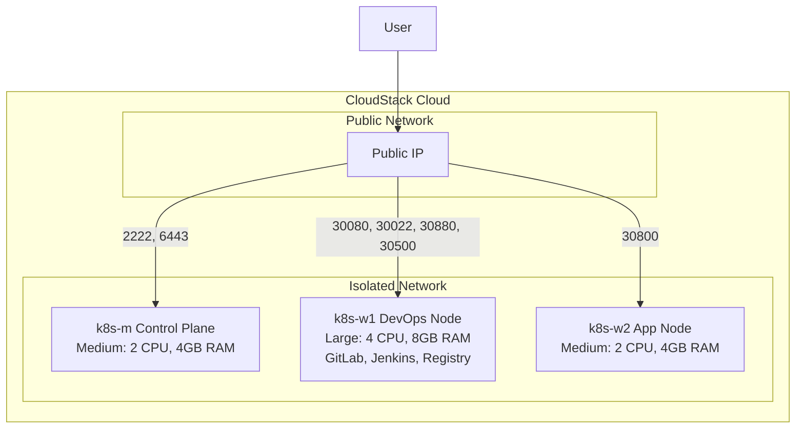
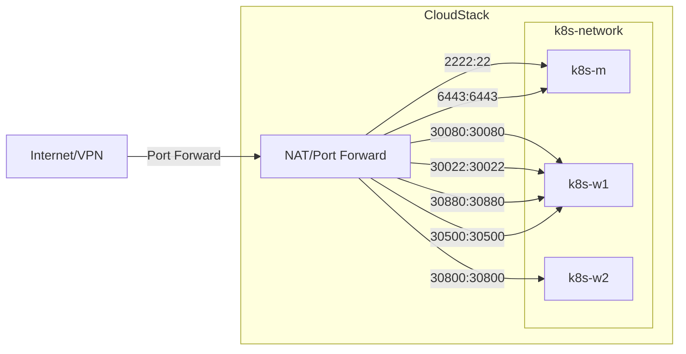

# Kubernetes CI/CD Infrastructure

Terraform → Ansible 단일 흐름으로 CloudStack K8s 클러스터부터 Git Push to Deploy CI/CD 파이프라인까지 완전 자동화한 IaC 프로젝트

**Cloud & Virtualization**


**Infrastructure as Code**


**Containerization & Orchestration**


**Networking**


**CI/CD & Registry**


- **기간:** 2025.11.27 ~ 2025.11.30 (4일)
- **역할:** 1인 프로젝트 (Infrastructure 설계 및 구축)

---

## 목차

- [프로젝트 개요](#프로젝트-개요)
- [인프라 아키텍처](#인프라-아키텍처)
- [핵심 엔지니어링 결정](#핵심-엔지니어링-결정)
- [빠른 시작](#빠른-시작)
- [디렉토리 구조](#디렉토리-구조)
- [핵심 학습 및 한계 인식](#핵심-학습-및-한계-인식)
- [주요 설정 참조](#주요-설정-참조)
- [참고 문서](#참고-문서)

---

## 프로젝트 개요

### 해결하려 한 문제

수동 Kubernetes 구성은 단계별 명령어 실행 순서에 의존하기 때문에 재현이 불가능합니다. 팀원이 동일한 환경을 다시 만들려면 동일한 실수를 반복하거나, 검증되지 않은 절차 문서에 의존해야 합니다. 또한 CloudStack 온프레미스 환경에서는 클러스터 네트워크, VM 프로비저닝, 포트 포워딩 규칙이 모두 수작업으로 맞물려야 하므로, 어느 한 단계의 누락이 전체 구성 실패로 이어집니다.

### 무엇을 만들었나

Terraform CloudStack Provider로 VM 3대(Control Plane 1, Worker 2), Isolated Network, Port Forwarding 7개 규칙을 선언적으로 정의하고, `terraform output`이 Ansible Inventory를 자동 생성하도록 연결했습니다. Ansible은 이 인벤토리를 받아 containerd 런타임 설치 → kubeadm 클러스터 초기화 → Cilium CNI 구성 → MetalLB 설치 → Jenkins/GitLab/Registry 배포까지 멱등하게 수행합니다. 최종적으로 GitLab Push 이벤트가 Jenkins 파이프라인을 트리거하여 Docker 이미지를 빌드하고 클러스터에 자동 배포하는 Git Push to Deploy 흐름이 완성됩니다.

### 기술 스택

- **Cloud Platform:** CloudStack
- **IaC (Infrastructure as Code):** Terraform
- **Configuration Management:** Ansible
- **Container Platform:** Docker
- **Container Runtime:** containerd v1.7.2
- **Container Orchestration:** Kubernetes v1.28.15
- **CNI:** Cilium v1.14.5
- **Load Balancer:** MetalLB v0.13.12
- **CI/CD Tools:** Jenkins, GitLab CE
- **Container Registry:** Docker Registry

---

## 인프라 아키텍처

### 전체 아키텍처



### 네트워크 구성



### Port Forwarding 규칙

| 서비스 | 외부 포트 | NodePort | Container Port | 포트 포워딩 대상 | Pod 배치 |
|--------|:---------:|:--------:|:--------------:|:---------------:|:--------:|
| SSH (Jump) | 2222 | - | 22 | k8s-m | - |
| Kubernetes API | 6443 | - | 6443 | k8s-m | - |
| GitLab HTTP | 30080 | 30080 | 80 | k8s-w1 | k8s-w1 |
| GitLab SSH | 30022 | 30022 | 22 | k8s-w1 | k8s-w1 |
| Jenkins | 30880 | 30880 | 8080 | k8s-w1 | k8s-w1 |
| Docker Registry | 30500 | 30500 | 5000 | k8s-w1 | k8s-w1 |
| TestApp | 30800 | 30800 | 80 | k8s-w2 | - |

### 노드 역할 분리 전략

GitLab(5Gi 메모리 요구)과 Jenkins(빌드 시 CPU 스파이크)는 리소스 집약적인 DevOps 도구입니다. 이 도구들을 애플리케이션 워크로드와 같은 노드에 배치하면, 빌드 실행 중 애플리케이션 파드가 자원 부족으로 Eviction될 수 있습니다. 이를 방지하기 위해 Node Selector로 워크로드를 물리적으로 분리했습니다.

- **k8s-w1 (DevOps Node):** GitLab, Jenkins, Registry 배치. Large 인스턴스(4 CPU, 8GB RAM)로 DevOps 도구의 메모리·CPU 요구를 수용합니다.
- **k8s-w2 (App Node):** 애플리케이션 워크로드(testapp) 배치. Medium 인스턴스(2 CPU, 4GB RAM)로 서비스 파드를 DevOps 도구 리소스 경합으로부터 격리합니다.

---

## 핵심 엔지니어링 결정

### 결정 1: Terraform Output → Ansible Inventory 자동 생성

**문제:** Terraform이 VM을 생성한 뒤 Ansible이 해당 VM의 IP를 알아야 합니다. 수동으로 IP를 복사해 Inventory를 편집하면 오타 가능성과 자동화 단절이 발생합니다.

**선택:** `terraform output -raw ansible_inventory > ansible/inventory/hosts.ini` 한 줄로 연결. Terraform `outputs.tf`가 hosts.ini 형식의 문자열을 출력하도록 설계하여, Ansible 실행 전 수동 개입을 0으로 만들었습니다.

**결과:** Terraform apply → output 파이프 → Ansible playbook 실행의 단일 자동화 흐름이 성립됩니다. 환경을 재구성할 때도 동일한 세 단계만 반복하면 됩니다.

### 결정 2: Cilium CNI (kube-proxy 대체 eBPF 모드)

**문제:** 기본 kube-proxy는 iptables 기반으로, 규칙 수가 증가할수록 패킷 처리 레이턴시가 선형 증가합니다. 또한 이후 서비스 메시 도입을 고려하고 있었는데, Cilium은 Istio와 통합이 검증된 CNI입니다.

**선택:** Cilium v1.14.5를 kube-proxy 대체 모드로 설치. eBPF 커널 프로그램이 iptables 규칙 없이 패킷을 직접 처리합니다.

**결과:** 소규모 클러스터에서도 네트워크 정책 적용이 iptables 없이 동작함을 확인했고, 이후 서비스 메시 도입 시 Cilium 위에 Istio를 통합할 수 있는 기반이 마련되었습니다.

### 결정 3: Node Selector 기반 워크로드 격리

**문제:** GitLab은 최소 4GB 이상의 메모리를 요구하며, Jenkins 빌드는 CPU 스파이크를 유발합니다. 이를 애플리케이션 파드와 같은 노드에 혼재시키면 리소스 경합으로 서비스 가용성이 불안정해집니다.

**선택:** 각 Deployment 매니페스트에 `nodeSelector: kubernetes.io/hostname: k8s-w1` (DevOps 도구) 또는 `k8s-w2` (앱 워크로드)를 명시하여 Kubernetes 스케줄러가 지정 노드에만 배치하도록 강제했습니다.

**결과:** DevOps 도구의 리소스 사용이 애플리케이션 파드에 영향을 주지 않는 격리된 실행 환경을 구성했습니다.

---

## 빠른 시작

### 1. 인프라 프로비저닝 (Terraform)

`terraform/terraform.tfvars` 파일 생성:

```hcl
# CloudStack API 설정
api_url    = "<CloudStack_API_Endpoint>"
api_key    = "<YOUR_API_KEY>"
secret_key = "<YOUR_SECRET_KEY>"

# 네트워크 설정
zone_name         = "YOUR_ZONE"
network_offering  = "DefaultIsolatedNetworkOfferingWithSourceNatService"

# SSH 키
ssh_public_key = "~/.ssh/k8s_key.pub"
```

```bash
cd terraform
terraform init
terraform plan
terraform apply

# Ansible Inventory 자동 생성
terraform output -raw ansible_inventory > ../ansible/inventory/hosts.ini
```

### 2. Kubernetes 클러스터 구성 (Ansible)

`ansible/group_vars/all.yml`에서 버전 확인 후 실행:

```yaml
kubernetes_version: "1.28"
kubernetes_apt_version: "1.28.15-1.1"
cilium_version: "1.14.5"
metallb_ip_range: "192.168.0.200-192.168.0.250"
```

```bash
cd ansible
ansible-playbook -i inventory/hosts.ini site.yml

# 클러스터 상태 확인 (Master 노드에서)
ssh -i ~/.ssh/k8s_key -p 2222 ubuntu@<YOUR_PUBLIC_IP>
kubectl get nodes
```

예상 결과:

```
NAME     STATUS   ROLES           AGE   VERSION
k8s-m    Ready    control-plane   1h    v1.28.15
k8s-w1   Ready    <none>          1h    v1.28.15
k8s-w2   Ready    <none>          1h    v1.28.15
```

### 3. DevOps 도구 배포

```bash
kubectl apply -f manifests/jenkins/
kubectl apply -f manifests/gitlab/
kubectl apply -f manifests/registry/
```

### 4. CI/CD 파이프라인 검증

테스트 애플리케이션을 별도로 생성합니다. `testapp` 디렉토리에 Dockerfile, Jenkinsfile, HTML 소스, Kubernetes 매니페스트(k8s/)를 구성한 뒤 GitLab에 push합니다:

```bash
mkdir testapp && cd testapp
# Dockerfile, Jenkinsfile, html/, k8s/ 디렉토리 구성
git init
git remote add origin <GitLab_Repository_URL>
git add .
git commit -m "Initial commit"
git push -u origin main
```

Jenkins에서 New Item → Pipeline → SCM: Git → Repository URL: `<GitLab_Repository_URL>` → Script Path: `Jenkinsfile` 순으로 설정한 뒤 "Build Now"를 실행합니다.

```bash
# 배포 확인
kubectl get pods -n devops -l app=testapp
```

---

## 디렉토리 구조

```
/
├── terraform/                    # Terraform IaC 코드
│   ├── provider.tf               # CloudStack Provider 설정
│   ├── main.tf                   # 리소스 정의 (VM, Network, Port Forward)
│   ├── variables.tf              # 변수 정의
│   ├── terraform.tfvars.example  # 변수 값 예시 (복사하여 terraform.tfvars 생성)
│   └── outputs.tf                # 출력 정의 (Ansible Inventory 자동 생성 포함)
├── ansible/                      # Ansible 구성
│   ├── ansible.cfg               # Ansible 설정 파일
│   ├── site.yml                  # 메인 플레이북
│   ├── group_vars/
│   │   └── all.yml               # 전역 변수
│   ├── inventory/
│   │   └── hosts.ini             # Terraform에서 자동 생성 (git 미추적)
│   └── roles/                    # Ansible Roles
│       ├── common/               # 공통 설정 (swap 비활성화 등)
│       ├── containerd/           # containerd 런타임 설치
│       ├── kubernetes/           # kubeadm, kubelet, kubectl 설치
│       ├── k8s_master/           # Master 노드 초기화
│       ├── k8s_worker/           # Worker 노드 조인
│       ├── cni/                  # Cilium CNI 설치
│       └── metallb/              # MetalLB 설치
├── manifests/                    # Kubernetes 매니페스트
│   ├── jenkins/                  # Jenkins 배포
│   │   ├── namespace.yaml
│   │   ├── deployment.yaml
│   │   ├── service.yaml
│   │   ├── pvc.yaml
│   │   └── config.yaml
│   ├── gitlab/                   # GitLab 배포
│   │   ├── deployment.yaml
│   │   ├── service.yaml
│   │   ├── pvc.yaml
│   │   └── secret.yaml
│   ├── registry/                 # Docker Registry 배포
│   │   ├── deployment.yaml
│   │   ├── deployment-tls.yaml   # TLS 활성화 버전
│   │   ├── service.yaml
│   │   ├── pvc.yaml
│   │   └── tls-secret.yaml      # TLS 인증서 시크릿 (값 직접 입력 필요)
│   └── metallb/                  # MetalLB 설정
│       ├── metallb-native.yaml
│       └── config.yaml.j2
├── docs/                         # 문서
│   └── TROUBLESHOOTING.md        # 트러블슈팅 가이드
└── README.md                     # 본 문서
```

---

## 핵심 학습 및 한계 인식

### 핵심 학습

**Ansible 멱등성 설계의 중요성**

동일한 플레이북을 두 번 실행했을 때 클러스터가 정상 상태라면 변경 없이 통과되어야 합니다. `kubeadm init`을 단순히 실행하는 것이 아니라, 이미 초기화된 클러스터인지 확인하는 조건 분기를 Role에 명시하는 작업이 멱등성 설계의 핵심임을 직접 확인했습니다.

**Terraform-Ansible 연계 패턴**

두 도구는 책임 경계가 명확합니다. Terraform은 인프라 상태(VM 존재 여부, 네트워크 구성)를 선언하고, Ansible은 소프트웨어 상태(패키지 설치, 서비스 구성)를 선언합니다. `terraform output`을 통해 두 도구를 연결하면 상태 정보를 수동으로 전달하는 오류 지점이 제거됩니다.

**Cilium eBPF 통합**

kube-proxy 대체 모드에서 Cilium이 iptables 규칙 없이 서비스 라우팅을 처리하는 방식을 확인했습니다. 동시에 Cilium 설치 파라미터 한 줄의 오입력이 CNI 전체 초기화 실패로 이어질 수 있음을 트러블슈팅 과정에서 경험했으며, 설치 파라미터 검증의 중요성을 인식했습니다.

### 인식한 한계

**온프레미스 환경 제약**

CloudStack 온프레미스는 클라우드 관리형 서비스(GKE, EKS 등)와 달리 Control Plane HA, 노드 오토스케일링, 관리형 스토리지를 제공하지 않습니다. 단일 Control Plane 구성이므로 Master 노드 장애 시 클러스터 전체가 단절됩니다.

**인프라 검증 체계 부재**

Terraform apply 이후 실제 VM이 올바른 스펙으로 생성되었는지, Ansible 적용 후 클러스터 상태가 기대값과 일치하는지를 자동으로 검증하는 체계가 없었습니다. 배포 결과는 수동 kubectl 확인에 의존했습니다.

---

## 주요 설정 참조

### Terraform 변수

| 변수명 | 기본값 | 설명 |
|--------|--------|------|
| `network_name` | `k8s-network` | 네트워크 이름 |
| `network_cidr` | - | 네트워크 CIDR 대역 |
| `network_gateway` | - | 게이트웨이 주소 |
| `zone_name` | - | CloudStack Zone 이름 |

### Ansible 변수

`ansible/group_vars/all.yml`:

```yaml
kubernetes_version: "1.28"
cilium_version: "1.14.5"
```

### Kubernetes 리소스 요약

| 서비스 | Namespace | Replicas | Memory Limit | CPU Limit | 배포 노드 |
|--------|:---------:|:--------:|:------------:|:---------:|:---------:|
| Jenkins | devops | 1 | 2Gi | 1000m | k8s-w1 |
| GitLab | devops | 1 | 5Gi | 2000m | k8s-w1 |
| Registry | devops | 1 | 512Mi | 500m | k8s-w1 |
| testapp | devops | 2 | 64Mi | 50m | k8s-w2 |

---

## 참고 문서

### 프로젝트 문서

- [트러블슈팅 가이드](docs/TROUBLESHOOTING.md)

### 공식 문서

- [Terraform CloudStack Provider](https://registry.terraform.io/providers/cloudstack/cloudstack/latest/docs)
- [Ansible Documentation](https://docs.ansible.com/)
- [Kubernetes Documentation](https://kubernetes.io/docs/)
- [Cilium Documentation](https://docs.cilium.io/)
- [MetalLB Documentation](https://metallb.universe.tf/)
- [Jenkins Documentation](https://www.jenkins.io/doc/)
- [GitLab Documentation](https://docs.gitlab.com/)
